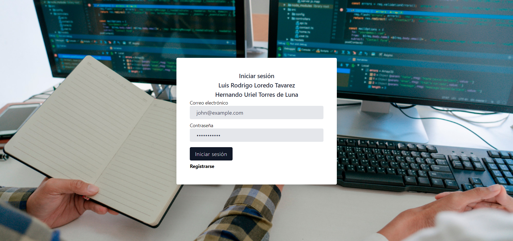

# Sistema de Administración de Proyectos

Este sistema fue desarrollado como parte de un proyecto universitario para la asignatura **"Tecnologías y aplicaciones en internet"**. El objetivo del proyecto fue crear una aplicación web que facilitara la gestión y organización de proyectos. Se trabajó en binas, con un periodo de desarrollo de cuatro semanas, y cada semana se nos solicitó completar un hito para evaluar nuestro progreso.

## Descripción del Proyecto

El proyecto final **Administración de Proyecto** sistema administrativo está diseñado para simplificar la administración de proyectos, la asignación de colaboradores y la gestión de clientes. Los administradores tienen control total sobre la creación y edición de proyectos, mientras que los colaboradores pueden gestionar sus propias asignaciones. El sistema permite agregar colaboradores, definir prioridades, gestionar pagos, y realizar un seguimiento detallado del estado de los proyectos.

## Perfiles de usuario y funcionalidades

### Perfil Administrador

1. **Tablero de indicadores:** 
   - Muestra tablas que resumen los avances de los proyectos, ingresos, tareas y clientes.
   
2. **Gestor de colaboradores:**
   - Listado en formato de cartas que permite agregar, editar y eliminar colaboradores. Visualiza la información clasificada de los colaboradores. [Ejemplo dado en clase](https://smarthr.dreamguystech.com/php/template/employees.php).
   
3. **Gestor de Clientes:**
   - Visualización de los clientes en un formato de cartas clasificado. Los administradores pueden agregar, editar y eliminar clientes. [Ejemplo dado en clase](https://smarthr.dreamguystech.com/php/template/clients.php).

4. **Gestor de Proyectos:**
   - Gestión de proyectos que incluye un listado con información relevante (nombre del proyecto, clientes, colaboradores, fechas, etc.). Cada proyecto permite la carga de archivos (imágenes, pdf), manejo de fechas de inicio y fin, así como la gestión de costos asociados. También se asignan colaboradores y clientes a los proyectos. [Ejemplo dado en clase](https://smarthr.dreamguystech.com/php/template/projects.php).

### Perfil Colaborador

1. **Tablero de Indicadores:**
   - Proporciona gcartas que muestran los pagos, proyectos en proceso y proyectos pendientes.

2. **Gestor de Finanzas:**
   - Vista de estado de cuenta, que muestra los ingresos por proyecto. También se presenta un balance general. [Ejemplo dado en clase](https://smarthr.dreamguystech.com/php/template/payments.php).

3. **Gestor de Proyectos Asignados:**
   - Listado de los proyectos en los que el colaborador está participando. Se muestran todos los proyectos asignados y su estado.

## Contribuciones del Equipo

Aunque fue un proyecto en binas, la totalidad del desarrollo técnico, incluyendo la programación, implementación de funcionalidades y despliegue en Digital Ocean, fue realizado principalmente por mí.

## Tecnologías Utilizadas

+ **Lenguajes de Programación:** PHP, HTML, CSS y JavaScript
+ **Base de Datos:** MySQL
+ **Frameworks:** Laravel y Tailwind CSS
+ **Librerías:** SweetAlert2 y Dropzone
+ **Herramientas de Desarrollo:** Docker, Visual Studio Code

## Instalación y Configuración

Para ejecutar este proyecto en tu entorno local, sigue estos pasos:

1. **Clona el Repositorio:**
```bash
git clone https://github.com/urieltorres-dev/sistema-de-administracion-de-proyectos.git
```

2. **Instala las dependencias de PHP y JavaScript:**
```bash
composer install
npm install
npm run dev
```

3. **Configura el Entorno:**
+ Asegúrate de tener PHP y MySQL instalados.
+ Configura los parámetros de la base de datos en el archivo `.env`.
+ Ejecuta las migraciones y seeders para crear las tablas y cargar datos de prueba:
```bash
php artisan migrate --seed
```

4. **Ejecuta el Proyecto:**
+ Inicia el servidor de desarrollo de Laravel:
```bash
php artisan serve
```
+ Accede a la aplicación a través de tu navegador en `http://localhost:8000`.

## Capturas de Pantalla

A continuación se muestran algunas capturas de pantalla de la aplicación:




## Demo

Por el momento la demo no está  disponible.

## Licencia

Este proyecto está licenciado bajo la Licencia MIT - consulta el archivo [LICENSE](https://choosealicense.com/licenses/mit/) para más detalles.

## Contacto

Para más información o consultas, puedes contactarme a través de [urieltorres.dev@gmail.com](mailto:urieltorres.dev@gmail.com) o en [github.com/urieltorres-dev](https://github.com/urieltorres-dev).

